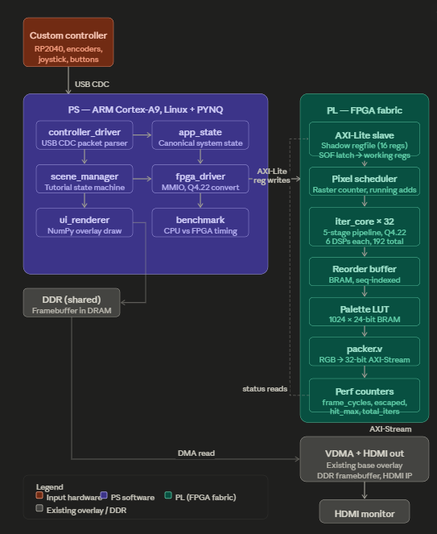

# FractalScope - Project Plan

**Platform:** PYNQ-Z1 (Zynq XC7Z020)

**Course:** ELEC50015 — Electronics Design Project 2 (Mathematics Accelerator)

**Team:** Anthony Bartlett (EIE), Denzil Erza-Essien (EIE), Lukas Mykhnenko (EEE), Junjiang Wu (EEE), Sam Wash (EEE), Aadi Sharma (EEE)

**Headline target:** 1280×720 @ ~60 FPS on typical Mandelbrot/Julia exploration, graceful degradation to ~20 FPS on inside-heavy / Multibrot views, FPGA-accelerated Mandelbrot family + logistic map, custom USB controller on a fabbed PCB, full educational walkthrough, CPU baseline at 7 optimisation levels.

---

## 0. Important Deadlines

```
Wed 20 May       ORDER COMPONENTS 
Fri 29 May       ORDER PCB
Mon  1 Jun 2026  INTERIM PRESENTATION
Mon 15 Jun       REPORT DUE 16:00 + individual reflection
Wed 17 Jun       Last day of lab access
Thu 18 Jun       DEMO + INTERVIEWS
```

Lab hours: ~09:00–17:00 weekdays. Closed evenings and weekends. £60 group budget. One PYNQ-Z1 board, shared.

---

## 1. Headline architectural decisions

These are load-bearing. Everything else follows.

1. **Use the starter project's streaming video path unchanged.** The accelerator is a pixel generator with an AXI-Stream master output and an AXI-Lite slave for control. The existing VDMA writes the stream into DDR; the existing HDMI subsystem reads DDR at constant rate.

2. **Pipelined iteration cores with replacement, replicated in parallel.** Target 16–32 cores at 100 MHz fabric clock. Each core holds a 7-stage pipeline performing `z = z² + c` one iteration per cycle. Pixels enter as scalar (x,y), iterate inside the pipeline, exit with an iteration count on escape or max_iter.

3. **Q4.22 fixed-point as the primary datapath (26-bit signed).** 4 integer bits (range ±8 with sign), 22 fractional bits. Comfortable zoom to ~3,000–10,000×.

4. **PS owns intent; PL owns throughput.** The custom controller produces input events. The PS interprets them into mode/parameter changes. The PS writes AXI-Lite registers. The PL renders. 

5. **Adaptive max_iter (variable FPS), not strict 60 FPS worst-case.** The FPGA reports actual completion time; if a frame takes too long, max_iter is clamped on the next frame. UI shows "rendering depth: N" so this is visible and educational rather than hidden.

6. **Skeleton-first build order.** Get a thin end-to-end slice working in Week 1 (one button on a breadboard → one register write → visible HDMI change). Add depth in Weeks 2–3. Polish in Week 4. 

---

## 2. System block diagram




---

## 3. Throughput budget and parallelism

### 3.1 Targets

- Resolution: 1280×720 internal render and output.
- Accelerator clock: 100 MHz target

### 3.2 Required iterations/second

- Typical view, avg ~60 iter/pixel: 3.3 G iter/s for 60 FPS.
- Worst case (every pixel hits max_iter = 256): 14.2 G iter/s for 60 FPS.

---

## 4. Fixed-point format and number analysis

### 4.1 Primary format: Q4.22 signed

- Total width: 26 bits. Sign bit: 1. Integer bits: 3. Fractional: 22.
- Smallest step: 2⁻²² ≈ 2.4×10⁻⁷.
- Pixel-step margin: usable zoom up to ~3,000× cleanly, tolerable quantisation visible to ~30,000×.


### 4.2 Overflow detection

Sticky `overflow_seen` bit in AXI-Lite STATUS register. Set when any iteration's `z_r²` or `z_i²` saturates the integer range. Cleared on register write. UI displays "precision limit reached" badge when set.

---


## 5. Software architecture (PS side)

### 5.1 State machine

```
BOOT → INIT_HARDWARE → MAIN_MENU
                          │
       ┌──────────────────┼──────────────────┐
       ▼                  ▼                  ▼
   WALKTHROUGH         EXPLORER          BENCHMARK
       │                  │                  │
       ▼                  ▼                  ▼
   scene 1..7      library + free      CPU vs FPGA
                   navigation          comparison
```

Single authoritative `app_state` object. All transitions explicit. No "current mode" lookup outside the state machine module.

### 5.2 Boot

systemd unit starts the app at boot:
1. Load the FPGA overlay via PYNQ.
2. Initialise HDMI (720p, with 600p/480p fallback if EDID fails).
3. Write palette banks into BRAM.
4. Open `/dev/ttyACM0` for the controller (retry loop, keyboard fallback on `/dev/input/event*`).
5. Enter MAIN_MENU.

User never sees a Linux prompt. Demo-ready boot in under 60 seconds.

---

## 6. Custom controller

### 6.1 Hardware 

- EEE team pls fill

Bus-powered from PYNQ USB host (~60 mA active).

### 6.2 MCU firmware responsibilities

- Encoder quadrature decoding (interrupt-driven, both edges).
- Button debouncing (5 ms hold-time filter).
- ADC sampling for joystick + pots at ~200 Hz.
- USB CDC packet emission at 100 Hz fixed cadence (deterministic, not on-change).
- CRC8 for packet integrity.

The MCU sends *events*, not commands. The PS decides what each one means.

### 6.3 Packet format

ASCII line-based:
```
FSCP,<seq>,<btn_hex>,<zoom_d>,<iter_d>,<jx>,<jy>,<knob0>,<knob1>,<crc>\n
```
Example: `FSCP,4521,01A0,+2,-1,128,-64,2048,3072,7F`

---

## 7. Educational content (walkthrough)

### Scene 1: Recurrence on the real line
PS-drawn number line, animated dot bouncing through `x → x² + c` with real `c`. Inputs: knob 0 sets c, NEXT advances.

### Scene 2: Recurrence on the complex plane
PS-drawn complex plane, point c, animated orbit trail. Inputs: joystick moves c, NEXT advances.

### Scene 3: Escape radius
PS-drawn plane with the |z|=2 circle highlighted. Orbit stays in forever or breaks out. Brief on-screen note: |z|>2 ⟹ escape. Inputs: joystick moves c, NEXT.

### Scene 4: Pixel = c
Coarse grid of c values (32×18). FPGA renders at this resolution. Each cell shows escape count as a number, then as a colour. The bridging scene from "iterate" to "image".

### Scene 5: Full Mandelbrot, free exploration
Full 720p FPGA render. Overlay shows centre, zoom, max_iter, FPS. Inputs: pan/zoom/iter knobs/palette.

### Scene 6: Mandelbrot ↔ Julia split-screen
Left half: Mandelbrot with cursor at current c. Right half: Julia for that c. **Strongest single educational moment.** Inputs: joystick moves the cursor (and thus Julia c), NEXT.

### Scene 7: Precision limits
Continue zooming. Show actual quantisation. Trip the overflow flag, display "precision limit reached". Honest engineering trade-off.

### Library mode (post-walkthrough)
Selectable grid: Mandelbrot, Julia, Burning Ship, Tricorn, Multibrot3, Logistic. Thumbnail (pre-rendered PNG), one-paragraph description, "explore" button. Each reuses the explorer UI; only FRACTAL_TYPE differs.

### Benchmark mode
Split-screen FPGA vs CPU on the same view. Live FPS counters for both. Live iterations/second. The "why FPGA" moment.

---

## 8. Simulation and verification

### 8.1 Verification Plan

The design is being verified in stages, starting with isolated SystemVerilog testbenches before moving towards full-system and hardware testing. The aim is to catch functional issues in simulation first, since this is much faster than debugging through repeated bitstream generation.

The verification flow is:

1. **Unit testbenches**  
   Each major RTL block is tested individually. These tests check expected outputs, ready/valid handshakes, reset behaviour, ordering, backpressure, and edge cases.

2. **Subsystem integration tests**  
   Once individual modules pass, larger sections are tested together.

3. **End-to-end simulation**  
   The full compute-to-colour pipeline is simulated over complete frames. This verifies that all pixels are generated, processed, reordered, coloured, and output in the correct sequence without missing or duplicated pixels.

4. **Stress testing**  
   Backpressure and stall conditions are applied to check that the ready/valid chain behaves correctly when downstream modules temporarily stop accepting data.

5. **Synthesis and implementation checks**  
   After behavioural simulation passes, the design is checked in Vivado for resource usage, timing closure, DSP inference, and whether the target clock can be met on the PYNQ-Z1.

6. **Hardware testing on PYNQ**  
   Finally, the bitstream is loaded onto the board and tested through the Python/PYNQ interface. This will confirm that the AXI-Lite register interface, HDMI/video output path, and full hardware pipeline work correctly in practice.

Overall, the verification strategy is to build confidence gradually: first proving each module in isolation, then proving the integrated pipeline, and finally validating the design on real hardware.

---

## 9. HDMI and resolution

- Default: 1280×720 @ 60 Hz.
- Boot-time fallback: hold MODE button on boot to cycle resolutions

PYNQ-Z1 HDMI documented to work reliably up to 720p; 1080p marginal. We target 720p and don't promise more.

---

## 10. Team allocation (two-team structure)

The project runs as two parallel teams. After Week 2 the EEE team pivots from controller work onto software and testing while the EIE team continues FPGA work end-to-end.

### EEE team

Phase 1 (Weeks 1 to 2): the controller is the priority. All four work on it together.

The Phase 1 sequence: validate the breadboard before committing to the PCB. Breadboard MVP by end of Week 1 (one button, one encoder, end-to-end). Full breadboard with all inputs by mid Week 2. PCB ordered Fri 29 May once the breadboard is genuinely working, not before.

Phase 2 (Weeks 3 to 4): once the PCB is ordered, two of the EEE team move onto educational scenes 4 onwards plus the library mode and benchmark UI. Two move onto integration testing, the hardware test ladder, demo rehearsal, and report drafting. 
When the PCB arrives, whoever's nearest in the hardware queue does the bring-up; it should be brief since the firmware is identical to the breadboard build.

### EIE team

Full 4 weeks on FPGA system, CPU baseline, early PS scaffolding.

---

## 11. Weekly Schedule

This plan has been updated at the end of Week 1. The first week ended up being RTL-heavy, so this has left the FPGA pipeline and verification flow in a much stronger position. The remaining plan is therefore focused on hardware bring-up, controller integration, performance measurement, and preparing a reliable final demo.

### Week 1: Mon 18 to Sun 24 May

**Main outcome:** establish the core architecture and get the first version of the compute pipeline working in simulation.

EIE progress this week focused on the FPGA datapath. The main RTL blocks were built or brought together: `pixel_scheduler`, `iter_core`, `iter_core_array`, `result_arbiter`, `reorder_buffer`, `colour_palette`, `perf_counters`, and the AXI/top-level wrappers. The `iter_core` was moved to a 7-stage pipeline after timing concerns with the earlier design, and the target was adjusted from 32 cores to 16 cores because of PYNQ-Z1 resource limits.

A lot of time was also spent on verification. Unit testbenches were written for the main blocks, and integration tests were built for the scheduler/core path and the wider compute-to-colour pipeline. The number precision study was started, with Q4.22 chosen for the current fixed-point datapath. The CPU baseline was also started with both single-threaded and multi-threaded versions.

EEE work focused on the controller side: confirming the input components, planning the controller layout, and starting the embedded/controller path. This includes the encoder/button/joystick input plan, the expected firmware responsibilities, and how controller events will eventually map onto PS-side register writes.

The main item that slipped from the original plan was a visible hardware image by the end of Week 1. The priority for Week 2 is therefore to turn the now-tested RTL pipeline into a working PYNQ demo.

### Week 2: Mon 25 to Sun 31 May

**Main goal:** get a visible output from the PYNQ board and prepare a credible interim demo.

EIE priorities:

- Load the current bitstream through the PYNQ/Jupyter flow.
- Confirm the `.bit` and `.hwh` files load correctly.
- Test AXI-Lite writes into the configuration registers.
- Get the display path working, starting with a simple visible output.
- Bring up Mandelbrot rendering on hardware, even if initially at low `max_iter` or conservative settings.
- Run timing/resource checks on the current 16-core design.
- Record early performance figures using the performance counters and CPU baseline.

EEE priorities:

- Continue controller hardware bring-up on breadboard.
- Validate the main physical inputs: encoders, buttons, joystick/pots where applicable.
- Continue firmware for input reading, debouncing, packet/control handling, and stable communication with the PS-side code.
- Work with EIE to agree the final control mapping: zoom, pan, mode switch, reset/start, max iteration control, and Julia constant adjustment.

**Important deadline:** by the end of Week 2, the project should have either a visible FPGA-generated fractal output or a clearly documented fallback demo path for the interim presentation.

### Week 3: Mon 1 to Sun 7 June

**Main goal:** move from “working pipeline” to “usable demo system”.

**Key deadline: Interim presentation on Mon 1 June.**

The interim presentation should show the current architecture, the verified RTL blocks, simulation results, CPU baseline progress, controller plan/progress, and any hardware output achieved by that point.

EIE priorities after the interim:

- Clean up the PS/PYNQ control interface.
- Add simple Python functions for setting view parameters: centre, zoom, mode, max iterations, Julia constants, and start/reset.
- Bring Julia, Burning Ship, and Tricorn into the hardware demo path if the register/control path is stable.
- Improve colour output enough for the demo, while keeping the simple palette as the fallback.
- Start collecting proper performance data: frame time, approximate FPS, total iterations, and CPU-vs-FPGA speedup.

EEE priorities:

- Complete the controller breadboard MVP.
- Stabilise firmware and input packet/update rate.
- Connect controller inputs to the PS-side control script.
- Begin PCB layout or finalise it if the breadboard design is stable enough.
- Prepare controller-related interim/final demo material: schematic, input mapping, firmware structure, and integration plan.

By the end of Week 3, the system should ideally support live interaction with at least the main Mandelbrot view, even if some advanced modes remain as preset/demo options.

### Week 4: Mon 8 to Sun 14 June

**Main goal:** stabilise the final demo and finish the report.

EIE priorities:

- Freeze the core FPGA feature set.
- Stop making risky RTL changes unless they fix a demo-blocking issue.
- Finalise timing/resource measurements.
- Finalise FPGA-vs-CPU performance comparisons.
- Make the PYNQ notebook/script reliable enough for repeated demo use.
- Capture backup screenshots/videos of the working output.

EEE priorities:

- Finish controller integration, either on breadboard or PCB depending on PCB arrival and bring-up.
- If the PCB arrives in time, bring it up and test it against the existing firmware.
- If the PCB is delayed or unstable, use the breadboard controller as the demo fallback.
- Finalise controller documentation, including hardware design, firmware behaviour, and how inputs map to the fractal controls.

Report priorities:

- Architecture section.
- Verification/testbench section.
- Number precision section.
- CPU baseline and performance comparison.
- Controller hardware/firmware section.
- Evaluation, limitations, and future work.

By the end of Week 4, the demo should be feature-frozen and the report should be mostly complete.

### Final Submission and Demo Period

**Mon 15 June 16:00:** final report and individual reflections submitted.

**Tue 16 / Wed 17 June:** final demo rehearsals, backup checks, and packaging of demo materials.

**Thu 18 June:** final demo and interviews.

The final demo target is a stable fractal explorer on the PYNQ board, controlled either through the physical controller or a PS-side fallback interface, with clear evidence of FPGA acceleration, tested RTL, and measured comparison against the CPU baseline.

---

## 12. Risk register

| Risk | Probability | Impact | Mitigation |
|---|---|---|---|
| Components delivered late by Onecall/RS | Low | High | Order Wed 20 May AM, |
| Controller PCB doesn't arrive in time | Medium | Medium | Breadboard rig is fully demo-capable. PCB is a presentation upgrade, not a functional one. Keep breadboard wiring tidy and labelled in case it has to run the demo. |
| Timing closure fails at 100 MHz with 32 cores | Medium | Medium | Drop to 24 cores first, then 16. 480p fallback covers worst case. |
| HDMI 720p fails on demo monitor | Low | High | Boot-time fallback to 600p or 480p via held button. Test on at least two different monitors before demo week. |
| Fixed-point too restrictive at demo zoom | Low | Medium | Limit zoom in the UI to a documented safe range. The overflow indicator is a feature, not a bug; scene 7 specifically exploits it. |
| SD card corruption | Low | High | Two SD cards. Image regularly. All source in git. |
| Member illness or absence in Week 4 | Low | High | Each subsystem has at least one document and one backup person who has run it. |

---

## 13. Demo plan (Thu 18 June, ~10 min)

Order is chosen so each segment stands alone. If one fails, the next still works.

1. **(0:00) Cold boot.** Power-on to main menu in under 60 seconds. Tests deployment and demonstrates "demo-ready" engineering.
2. **(1:00) Walkthrough scenes 1 to 4.** Real-line recurrence, complex-plane recurrence, escape radius, pixel-equals-c grid. Tells the educational story.
3. **(4:00) Scene 5: full Mandelbrot exploration.** Custom controller drives pan, zoom, max_iter, palette. The headline 60 FPS in the typical case. Tests user-input system, custom hardware, and the main throughput claim.
4. **(5:30) Scene 6: split-screen Mandelbrot and Julia.** Joystick moves a cursor on the Mandelbrot side; the Julia parameter c follows. The strongest single educational moment.
5. **(7:00) Library mode.** Cycle through Burning Ship, Tricorn, Multibrot3, logistic map. Demonstrates the multi-algorithm framework.
6. **(8:30) Benchmark mode.** Split-screen FPGA vs CPU on the same view, live FPS counters visible. The "why FPGA" justification, with numbers.
7. **(9:30) Scene 7: precision limits.** Continue zooming until the overflow flag trips and "precision limit reached" appears. Honest engineering trade-off discussion.

Question and answer: each member is ready to talk to their subsystem. The marker rubric expects this explicitly.

---

## 16. Proposed extensions

### List of potential Extensions:

**Periodicity checking optimisation.** Inside-set pixels typically enter a periodic orbit within a handful of iterations. Detecting that they are cycling lets the core short-circuit to `iter = max_iter` immediately, freeing the pipeline for new pixels. Two implementation routes: a stationary-point detector (compare `z` to `z` from N iterations ago; if the difference is below epsilon for several iterations in a row, assume periodicity), or Brent's cycle detection with a small comparison window. Either route adds roughly 30 percent to the iteration core complexity. Expected speedup on inside-heavy views is 2x to 5x. This is a real engineering contribution worth a paragraph in the report, with measured before/after FPS numbers on three reference views.

**Distance estimation rendering.** Track the derivative `dz/dc` alongside `z` in the iteration core: `dz/dc` updates as `dz_new = 2 * z * dz + 1`. After escape, the estimated distance from the pixel to the set boundary is approximately `|z| * log|z| / |dz|`. Rendering this distance as brightness produces a striking pseudo-3D illuminated look around the boundary. Costs 1 extra DSP per core for the derivative multiply, plus a divide at output time (can be a small reciprocal LUT). Visually transformative; very photogenic for the demo.

**Real-time orbit overlay in scene 5.** For the single pixel under the cursor, compute its iteration orbit on the PS side (no FPGA work needed since it's one pixel) and draw it as a connected polyline overlay on top of the FPGA rendering. This is the visual link from the recurrence scenes 1 to 3 to the full Mandelbrot in scene 5: the user sees the orbit they've been learning about, alive on the actual set. Pure NumPy and bitmap overlay. Probably one day of work.

**Mariani-Silver boundary tracing.** Classic Mandelbrot rendering optimisation. For any rectangular region, if the entire perimeter renders to the same iteration count, the interior must too (a consequence of the Mandelbrot set being connected). Algorithm: render perimeters first, recurse only into regions whose perimeters are non-uniform. On inside-heavy zoomed views, this can deliver 5x or more speedup, since vast solid-colour interior regions render with only their perimeter pixels. Implementation is PS-side: PS commands the FPGA to render specific row ranges or column ranges. Requires some FPGA cooperation (probably an X_START, X_END, Y_START, Y_END register addition for sub-frame rendering), but mostly software. Mid-week 4 work.

**Auto-tour mode.** Predefined list of named locations on the Mandelbrot set (Seahorse Valley, Elephant Valley, Mini Mandelbrot at -1.75, the Spiral, Mariana Trench, and so on). Smooth Catmull-Rom interpolation between them, with constant-speed parameterisation so the camera moves at a consistent visual rate regardless of segment length. PS-side only; no FPGA changes. About two days for a polished implementation including a curated tour list and on-screen captions explaining each location. Excellent demo material.

**Buddhabrot rendering.** Alternative visualisation: instead of colouring pixels by their own iteration count, you colour each pixel by how many other pixels' orbits passed through it. Procedure: launch a swarm of random `c` values, iterate them, and for those that escape, walk their orbit again and accumulate a "1" in a histogram at every pixel the orbit visited. Brightness reveals the unconscious paths through which the set funnels its escapees. Reuses the histogram BRAM and accumulation infrastructure that the logistic map mode already requires. Three to four days. Different aesthetic that distinguishes the report visually.

**Stripe colouring and orbit traps.** Conventional colouring uses iteration count. Stripe colouring uses the angle of `z` at escape: `colour = average over iterations of (1 + sin(s * arg(z_i))) / 2`. Orbit traps use the closest approach of the orbit to a geometric shape (a line, a circle, a star). Both produce wildly different aesthetic results from the same underlying compute. Adds maybe one comparison and one accumulator per iteration core. Cheap to add, gives the library mode much more variety, very photogenic.

**Perturbation theory for deep zoom.** Standard fixed-point Mandelbrot caps out around 10^4 zoom; perturbation lets you zoom to 10^15 or beyond with the same hardware precision. Method: choose one "reference" pixel near the centre of the view. Compute its full orbit `Z_n` in high precision on the PS side using `mpmath` or `gmpy2`. For every other pixel, compute its deviation `δ_n = z_n - Z_n` in low-precision fixed point on the FPGA, using the recurrence `δ_{n+1} = 2 * Z_n * δ_n + δ_n² + δ_c`. The FPGA needs to read the high-precision reference orbit one step at a time (PS streams it in via AXI-Lite or a dedicated AXI-Stream input). When `|z_n|` gets large enough that perturbation breaks down (a "glitch"), pick a new reference and re-run those pixels. Implementation effort is high; the mathematical and engineering payoff is enormous. Two weeks of focused work for a polished version; possible to do a basic version in a week if perturbation glitches are not handled.

**Audio sonification.** Convert orbit data (e.g. the angular position of `z` at each iteration step) into audio tones for the current cursor pixel. Synaesthetic exploration mode. A day of work for a basic implementation; the artistic question of what makes a "good" sonification is harder than the engineering. Fun if there's time; not a strong rubric contribution.