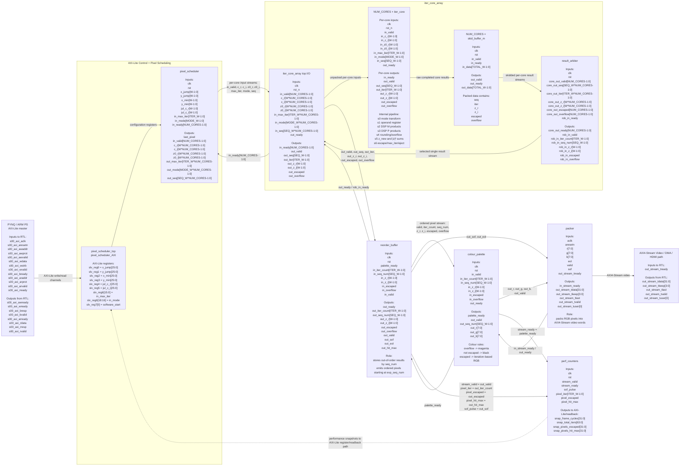

# Week 1 Log

## EIE Team

### FPGA Acceleration

We started on work for the first FPGA pipeline over this week. We did a large amount of the RTL work and brainstorming on Tuesday, before picking it back up on Saturday/Sunday. We are currently at the stage of testing the hardware through Jupyter notebooks to hopefully get some stuff displayed this week. 

#### RTL

Below is a diagram showing the structure of the RTL

Design Decisions:

- iter_core is the main computation block, and uses a 7-stage pipeline to make the escape calculations. This was upped from a 5-stage pipeline due to Worst Negative Slack issues we were encountering. We run 16 of these cores in parallel (reduced from 32 due to LUT constraints in the PYNQ-Z1)

- The reorder_buffer is used in between the iter_core array and the colour palette to ensure that the pixels are ordered before continuing

- We implemented a very simple colour palette without any smoothing or further enhancements just yet. This is so that we can just get a basic MVP working for the presentation. 

- The packer is the same as was provided in the project brief

- We have performance counters which will be used later on to compare with the baseline.

- We included a wrapper to the iter_core block given the "array style" inputs we had implemented in our original design

- We also included a skid buffer to ensure we had correct passing of data through the cores to the arbiter without causing signals between cores to intersect eachother

#### Testbenches

Every major RTL source now has a corresponding SystemVerilog testbench. This has been especially useful because debugging in simulation is much faster than repeatedly generating and testing bitstreams on the PYNQ board.

Testbenches implemented:

- `iter_core_tb.sv` tests the main fractal iteration core. It covers Mandelbrot, Julia, Burning Ship, and Tricorn modes, as well as overflow behaviour, max-iteration cases, burst inputs, backpressure, reset during activity, and sequence-number correctness.

- `pixel_scheduler_tb.sv` checks that the scheduler generates the correct pixel coordinates, assigns sequence numbers correctly, handles frame completion, and drives the correct per-core inputs.

- `tb_iter_core_array.sv` verifies the multi-core wrapper around the individual `iter_core` instances, including result collection and ready/valid behaviour across multiple cores.

- `arbiter_tb.sv` tests the result arbiter that selects between completed outputs from multiple cores. It checks round-robin selection, backpressure handling, and that only the selected core receives `ready`.

- `reorder_buffer_tb.sv` checks that out-of-order core results are stored and emitted in the correct sequence order before being sent to the colour pipeline.

- `colour_palette_tb.sv` verifies the basic colour mapping stage, including escaped pixels, in-set pixels, overflow/debug colouring, output valid/ready behaviour, and stall handling.

- `scheduler_iter_core_tb.sv` provides an integration test between the scheduler and the iteration cores, confirming that scheduled pixels are processed correctly across multiple cores.

Overall, the testbenches now cover both individual module behaviour and larger subsystem integration. This gives us much more confidence that the compute pipeline works before moving to synthesis, implementation, and hardware testing.

### Number Precision Study

A separate number precision study was carried out to decide what fixed-point format should be used for the fractal calculations. This was important because the design needs enough precision for visually stable zooming, while still fitting efficiently on the FPGA.

The study compares different fixed-point formats and considers the trade-off between:

- numerical accuracy
- visual quality of the generated fractals
- DSP/LUT resource usage
- timing closure difficulty
- maximum zoom depth

From this, we chose to use a Q4.22-style representation for the main complex-number datapath. This gives 26-bit signed fixed-point values, with enough fractional precision for the current MVP while keeping the arithmetic manageable for the PYNQ-Z1.
 

More detail is available in the dedicated precision write-up: [Number Precision Study](../studies/number_format/README.md).

### CPU Baseline

In starting the CPU_baseline design, the following implementations were made:

- The formation of a naive single-threaded approach to understand a worst-case scenario.

- A multi-threaded approach to obtain the best-case cpu scenario, both with actual manual tests and a C++ `std::thread::hardware_concurrency()` insturction to obtain the optimal number of threads for latency reduction

- Functions allowing for the calculation of multiple sets mirroring those in `iter_core_tb.sv`

### PS start

Since the RTL is still not complete, we haven't started proper work on the PS side yet. We looked a little into displaying a Mandelbrot set through the PYNQ board, but not much further that that. The notebook can be seen here: [Basic Display](../../notebooks/1_basic_display.ipynb).

### Updates to Plan/Timeline and Evaluation

In terms of the RTL, the next steps for the following week are as such:

- **Have a working display** - This is a core goal that we plan to have achieved ASAP

- Timing analysis between hardware & software based designs - average speedup/ total latency calculations of our v1 design

- Cleaned up cpu_baseline - i.e. separate filing for timing analysis and actual implementation - low priority but still should be achieved

- Resource optimisation of the v1 design - crucial as this allows us to implement extension ideas without worrying about resource demand

- Extension & Presentation Planning - Interim presentations are coming up in a weeks time therfore having a plan of what we will present and how we plan to expand our base design is key

## EEE Team